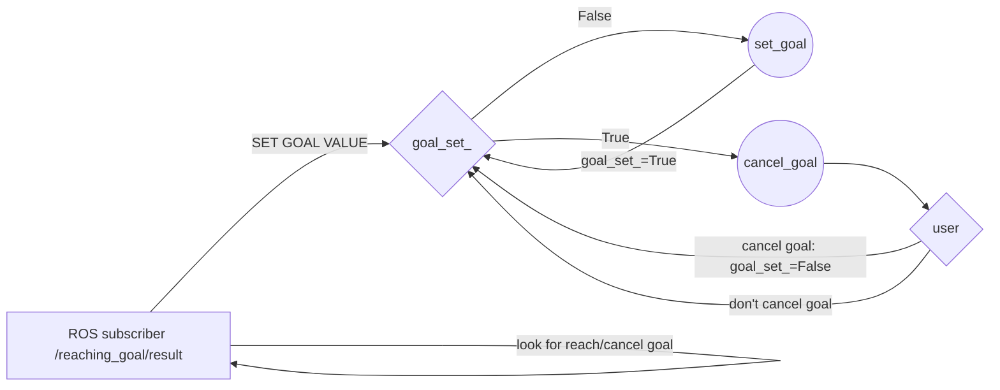

Assignment solution
==========

The second assignment of research track 1 has been solved by adding 4 python files into the scripts folder: client.py, publisher.py, subscriber.py, status_service.py. Also a custom message and a custom service have been added.
Client.py and publisher.py implement the solution to question (a).
Status_service.py implements the solution to question (b).


How to run it
----------
To run the whole simulation please run the commands

```console
roslaunch assignment_2_2022 assignment2.launch
rosrun assignment_2_2022 client.py
```
The client scripts implementing the ``target_client_py`` ROS node has been kept separate, i.e. it is not launched by the launch file as in principle I believe that for a better user experience 2 bash panels should be better understandable: 1 panel for the user interface
1 panel for the results.
Indeed this idea turned out to be helpful in the assignment of Research Track 2 with respect to the interaction with the Jupiter Notebook.
The code has been tested and proved to be working in all the executions.
The package can be built even starting from a clean workspace, no dependency issue arised.

Flow chart and pseudo-code of user interface node
----------

client.py high level logic:



client.py pseudocode:

```
import ros related libraries
...

client = actionlib client

def goal_callback(data):
    if <previous goal has been cancelled or reached>
        Set global variable goal_set_ to False
        
def target_client(a,b):
    <client waits for actionlib server>
    Set goal_x_variable=a
    Set goal_y_variable=b
    <client publishes goal>
    
def main():
    <initialize node>
    <initialize global variable goal_set_>
    <allow main function to use client variable>
    <define P as a subscriber to /reaching_goal/result to call the goal_callback>
    
    while not rospy.is_shutdown():
        if goal_set_==False:
            <user sets a goal>
            goal_set_=True
        else:
            <user can cancel the current goal>
            if <user does>:
                <client cancel goal>
                goal_set_=False

```


Added custom messages and services structure
----------
Kinematic.msg is a custom message, it has 4 fields:

float64 x: x-position of the robot
float64 y: y-position of the robot
float64 vel_x: linear velocity of the robot along x
float64 vel_z: angular velocity of the robot

Reached.srv is a custom service, it has no input, so it can be called from shell by typing:

``` rosservice call /reached```

The response is:

int32 reached: how many goals have been reached
int32 cancelled: how many goals have been cancelled

Documentation
----------
Since the code has been developed in python, the documentation has been written with Sphinx.
Doxygen related lines of code in the ```assignment_2_2022/source/index.rst``` file have been commented in the end as not strictly necessary.


